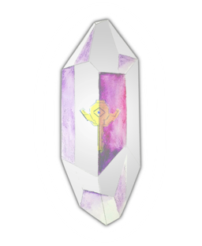

# Dark Crystal Key Management

<h2>Backup your secrets using the trust in your social fabric</h2>

Dark Crystal is a set of protocols, libraries, techniques and guidelines for secure management of sensitive data such as cryptographic keys. 

The idea is to make key management easy by emphasising trust between peers rather than individual responsibility.

It is a toolkit for developers who want to bring secure and easy to use key management techniques to their project.  It is particularly well suited for decentralised systems where authentication relies on keys stored on a peer's device.

---

- **Transport agnostic** - Key backup and recovery mechanisms that work with your existing transport mechanism.
- **Flexible** - Pick features which meet the needs of your individual project.
- **Easy to use** - Includes template designs for making intuitive interfaces.
- **Empowering for peers** - Peers keys are secured by trust in their social network.

---

There is a [reference implementation in Javascript](https://gitlab.com/dark-crystal), with implementations in other languages planned.

Dark Crystal is 100% open source, licensed [AGPL3](https://www.gnu.org/licenses/agpl-3.0.en.html).  You can use [our modules](https://gitlab.com/dark-crystal) in your projects, or just take inspiration from them to implement something similar. Every project has different needs, so we are trying to establish good patterns rather than build a generic tool which everybody should use.

The reference implementation uses the [libsodium](https://download.libsodium.org/doc/) crypto library, [Daan Sprenkle's secret sharing library](https://github.com/dsprenkels/sss), and [herumi's implementation ](https://github.com/herumi/bls) of the [Boney-Lynn-Shacham signature scheme](https://hovav.net/ucsd/dist/sigs.pdf).  All are written in C/C++ with bindings to many popular languages.

---

