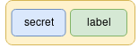
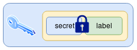
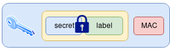
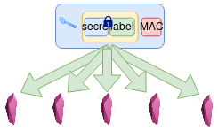
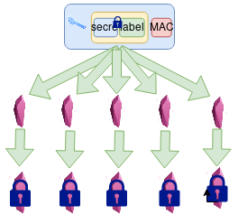
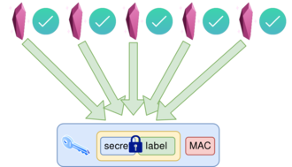

# Dark Crystal Social Recovery Protocol Specification

## Introduction

Dark Crystal is a social key management system.  It is a set of protocols and recommendations for responsibly handling sensitive data such as secret keys. 

It is designed for safeguarding data which we don't want to loose, but which we don't want others to find. 

The idea is that rather than creating a generalised piece of software for managing keys, key management techniques should be integrated into the applications which use the keys. So the techniques described and libraries provided can be seen as recommendations for developers wanting to improve key management for particular applications.  Of course, every situation is different and in many cases the protocols will need to be adapted for particular needs.

This document is describes a social key backup and recovery technique, to enable lost keys to be recovered.  It must be emphasised that key recovery cannot solve the problem of compromised keys. It is appropriate only to recover encrypted data following loss of a key, or for continued use of a key when it is known to be lost but not compromised, for example following accidental deletion or hardware failure. 

## Terms used

- ***Secret*** - the data to be backed up and potentially recovered.
- ***Secret-owner*** - the peer who initiates the backup.
- ***Shard*** - a single encrypted share of the secret. 
- ***Custodian*** - a peer who holds a shard, generally a friend or trusted contact of the secret owner.

## Key Loss Scenarios

The process of recovering a key 

- ***'swim'*** - key loss - eg: Computer fell into the sea and is lost forever.
- ***'theft'*** - key compromise - eg: I forgot my computer on a train and no idea who might have it.
- ***'inheritance'*** - following death or incapacitation, a key can be recovered by heirs.

## Peer experience

This is a technical specification of the protocol. Many stages of the process will be automated and not visible to the peers.  [Interface recommendations](ui-recommendations.md) and peer stories are described elsewhere.

## Descriptions of modules used in the reference implementation

### [secret-sharing](https://gitlab.com/dark-crystal/secret-sharing)

A wrapper around [dsprenkels/sss](https://github.com/dsprenkels/sss) providing functionality specific to dark-crystal key backup.

### [key-backup-crypto](https://gitlab.com/dark-crystal/key-backup-crypto) 

Contains cryptographic functions key backup and recovery.

### [key-backup-message-schemas](https://gitlab.com/dark-crystal/key-backup-message-schemas)

Contains JSON and (soon) protobuf template schemas for Dark Crystal key backup messages.  Also included are validation methods in javascript - [json-schema.org](https://json-schema.org/) using [is-my-json-valid](https://github.com/mafintosh/is-my-json-valid), and tests.

### [key-backup](https://gitlab.com/dark-crystal/key-backup)

A high level class for Dark Crystal key backup and recovery

## Setup process

### Step 1 - Combine secret with contextual metadata

This is to indicate the intended purpose of the secret, meaning that it is still useful if recovered 'out of context'. This will generally include a 'label' property which will be a human readable description, including, for example, the name of the application it is useful for. This may also include application-specific data. This is because, as Pamela Morgan makes clear in her book 'Cryptoasset inheritance planning', recovering a key is only half the story.  For it be useful, we need to know what to do with it.

The amount of information included here depends on how critical it is that share size is kept small.

In the included library, we have used [protocol buffers](https://developers.google.com/protocol-buffers/) to encode this message.

- [`packLabel` in API Documentation](https://gitlab.com/dark-crystal/key-backup-crypto#const-packed-packlabelsecret-label)
- [`packLabel` source code](https://gitlab.com/dark-crystal/key-backup-crypto/-/blob/f84e9726b5770e821ce083df32c156129f6b22dc/index.js#L15)

### Step 2 - Encrypt data with symmetric key

If the data to be backed up is larger than 32 bytes, the data is encrypted with a symmetric key and this key is taken to be the secret. Otherwise, the data itself is taken to be the secret. It needs to be noted that many implementations of secret sharing do this internally, and produce shares which are a concatonation of a key-share and the encrypted secret.

This means there is some duplication of data - a portion of each share is identical to the others. So in the case of particularly large secrets, it makes sense if the encrypted secret is stored only once in a place which is accessible to all share-holders (if the practicalities of the chosen transport layer make this possible).

- [`encrypt` in API documentation](https://gitlab.com/dark-crystal/secret-sharing#encrypt)
- [`encrypt` source code](https://gitlab.com/dark-crystal/secret-sharing/-/blob/9f484e9f47e726164b7ee975d32f4ca1f35b4780/index.js#L14)

### Step 3 - Message Authentication Code added

The secret is appended with it’s SHA-256 hash which serves as a message authentication code (MAC). This allows us to later verify that the secret has been correctly recovered.

It is assumed that in step 2, the symmetric encryption algorithm used will also use a MAC.

- [Source code](https://gitlab.com/dark-crystal/secret-sharing/-/blob/9f484e9f47e726164b7ee975d32f4ca1f35b4780/index.js#L19) (this is done internally in `encrypt`)

### Step 4 - Shards generated

Shards are generated using a secure threshold-based secret sharing algorithm, [dsprenkels/sss](https://github.com/dsprenkels/sss) 

If you are interested, here is an [explanation of secret sharing in very simple terms](shamirs-secret-sharing.md)

- [`share` - low-level - in API documentation](https://gitlab.com/dark-crystal/secret-sharing#share)
- [`share` - low-level - in source code](https://gitlab.com/dark-crystal/secret-sharing/-/blob/9f484e9f47e726164b7ee975d32f4ca1f35b4780/index.js#L60)

### Step 5 - Shards are signed

Each shard is signed by the owner of the secret using a keypair with an established public key (such as the same keypair used to sign other messages in the application).

Shards are appended with these signatures.

This is to protect against shards being modified, maliciously or accidentally.  A discussion for this design decision can be found in the article [Security Considerations for Secret Sharing](security-shamirs.md)

- [`signShard` in API documentation](https://gitlab.com/dark-crystal/key-backup-crypto#signshard)
- [`signShard` source code](https://gitlab.com/dark-crystal/key-backup-crypto/-/blob/c8fcc37ea8ebc8431a00a957ca7bc34130cc90f9/index.js#L37)

### Step 6 - Schema version number and timestamp added

A version number ensures backward compatibility with future versions of the protocol.

A timestamp allows secret-owner and custodian to keep track of what happened when.

- [`_buildMessage` source code](https://gitlab.com/dark-crystal/key-backup/-/blob/82831daa9ad9f0d29b0fe4b124f14c203c37df31/index.js#L108)

### Step 7 - Signed shards encrypted for each custodian

Shards are encrypted with the public key of each custodian. The unencrypted shards are removed from memory. 

'One-way box' is used to ensure the custodian can read the message, but the secret-owner cannot read it themselves.

This is inspired by [private-box](https://github.com/auditdrivencrypto/private-box), see [this note in the design document](https://github.com/auditdrivencrypto/private-box/blob/master/design.md#one-way-box).  We could also just use private-box itself for this, but this method is simpler and gives us smaller shards.

- [`oneWayBox` in API documentation](https://gitlab.com/dark-crystal/key-backup-crypto#onewaybox)
- [`oneWayBox` source code](https://gitlab.com/dark-crystal/key-backup-crypto/-/blob/95f1471aa8a15dca5042f175e83f41f3db0f7230/index.js#L131)

### Step 8 - Transmission

Each encrypted shard is packed together with some metadata into a message, transmitted to the custodian, and a local (encrypted) copy is retained.

Additionally, a '`root`' message is published which is encrypted only to the secret owner themselves, which contains some metadata describing the secret.

Details of these messages, as well as of the system of requesting, responding, and forwarding shards, are explained in the [message schemas section](message-schemas.md)

## Recovery process

### Step 1 - New identity

Upon loss of data, the secret owner establishes a new account, giving them a new identity on the system. This step depends a lot on the transport mechanism used, but generally will involve generating a new keypair.

### Step 2 - Contact custodians

The secret owner contacts the custodians 'out of band' to confirm that the new identity belongs to them. That is, it is assumed that there is the possibility of some personal contact to convince the custodians that the new identity is really the secret owner.  For example this might involve a phone call saying "hey, its me!".

Due to the threshold nature of the scheme there is a degree of tolerance to some custodians being unavailable or uncooperative.

### Step 3 - Return shards

Each custodian decrypts the shard they are holding with their personal keypair, and re-encrypts it to the public key of the new account. It is then sent to the new account of the secret owner.

The nature peer to peer protocols make it difficult to delete data. If this is the case with the transport mechanism you are using, we recommend adding a second layer of encryption using an ephemeral keypair. This is a single-use keypair which can later be deleted to effectively delete these messages from the system.  This will be explained in more detail in a separate document.

### Step 3 - Decrypt shards

The secret owner decrypts the shards they receive, using `oneWayUnbox`.

- [`oneWayUnbox` API documentation](https://gitlab.com/dark-crystal/key-backup-crypto/-/tree/master#onewayunbox)
- [`oneWayUnbox` source code](https://gitlab.com/dark-crystal/key-backup-crypto/-/blob/master/index.js#L144)

### Step 4 - Validate shards

The signature of each shard is validated with the original public key, proving that the returned shards are identical to those sent out. 

- [`openShard` API documentation](https://gitlab.com/dark-crystal/key-backup-crypto/-/tree/master#openshard)
- [`openShard` source code](https://gitlab.com/dark-crystal/key-backup-crypto/-/blob/95f1471aa8a15dca5042f175e83f41f3db0f7230/index.js#L53)

In the case that the shard could not be validated, the shard data can be retrieved anyway using `removeSignature`.

- [`removeSignature` API documentation](https://gitlab.com/dark-crystal/key-backup-crypto/-/tree/master#removesignature)
- [`removeSignature` source code](https://gitlab.com/dark-crystal/key-backup-crypto/-/blob/95f1471aa8a15dca5042f175e83f41f3db0f7230/index.js#L63)

### Step 5 - Secret recovery

The shards are combined to recover the secret.

- [`combine` low-level API documentation](https://gitlab.com/dark-crystal/secret-sharing#combine)
- [`combine` low-level source code](https://gitlab.com/dark-crystal/secret-sharing/-/blob/9f484e9f47e726164b7ee975d32f4ca1f35b4780/index.js#L80)

### Step 6 - Validate secret

The MAC is used to establish that recovery was successful.  This means we can be sure the combining process worked as planned and offers some protection against tampering.

### Step 7 - Decrypt secret

Finally the secret is restored, along with a descriptive label.

- [`decrypt` API documentation](https://gitlab.com/dark-crystal/secret-sharing#decrypt)
- [`decrypt` source code](https://gitlab.com/dark-crystal/secret-sharing/-/blob/9f484e9f47e726164b7ee975d32f4ca1f35b4780/index.js#L24)
- [`unpackLabel` API documentation](https://gitlab.com/dark-crystal/key-backup-crypto#unpacklabel)
- [`unpackLabel` source code](https://gitlab.com/dark-crystal/key-backup-crypto/-/blob/95f1471aa8a15dca5042f175e83f41f3db0f7230/index.js#L21)

### Step 8 - Recover old account

Depending on whether the lost account might have been compromised, it may be appropriate to abandon the new identity and continue to use the old one. If this is not the case, the key can at least be used to recover data encrypted to it.
