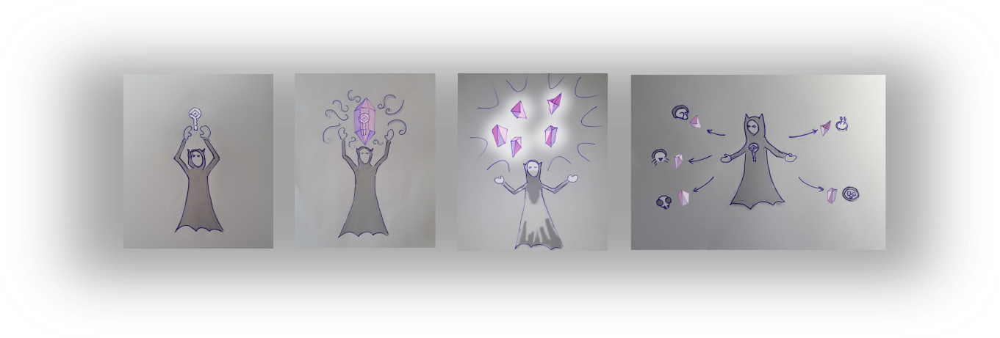
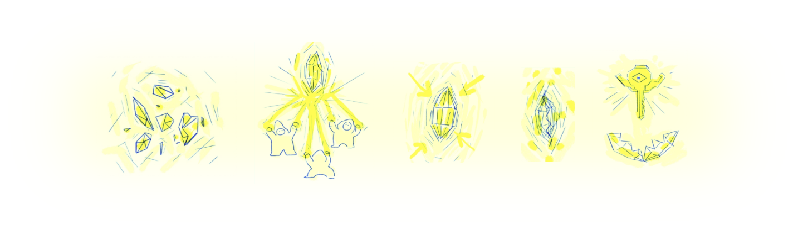

# The Protocols

## [Dark crystal key recovery](protocol-specification.md)

### Backup your secret keys - using trust in your social network.

- You split your key into five 'shards' and send them to your trusted friends

- If you loose your device you can ask any three friends to return them to your new account.

This protocol allows lost keys to be recovered.  This would be useful to decrypt existing data, or so that an account can continue to be used.

It works by using a threshold secret sharing scheme.  [What is secret sharing?](shamirs-secret-sharing.md) 

This is done is such a way they the identities of the members of the support group are kept private, and that there is specific degree of tolerance to a particular group members being unavailable or uncooperative. 

- [Protocol specification](protocol-specification.md)

--- 

## [Dark crystal key re-issuance](threshold-signatures.md)

This protocol provides a way of establishing a new key, so that an identity can be seen to persist to a new key.  This specifically addresses the cases where keys might have been compromised. 

It works be each peer assigning a 'support group' who are empowered to make assertions on their behalf.  The support group can announce a new key when the old one is assumed to be compromised, and client software can resolve these announcements to get the current key for a particular identity.

This is done is such a way they the identities of the members of the support group are kept private, and that there is specific degree of tolerance to a particular group members being unavailable or uncooperative. 

It uses group threshold signatures using the Boney-Lynn-Shacham signature scheme.

- [High level explanation of the key re-issuance system](key-reissuance.md) 
- [Proposal for Key re-issuance using threshold signatures](threshold-signatures.md)

--- 

## Paper Keys

Sometimes the simplest ideas are the best. Keys can also be backed up by printing them as QR codes or mnemonics.

- [paper key backups](paper-keys.md)
