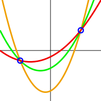

# What is secret sharing?

When we talk about 'secret sharing' we are talking about mathematical algorithms which can be used to make distributed backups of a piece of data. By distributed we mean stored in multiple locations.

These schemes are also known as threshold schemes, because they have the property that a particular threshold amount of shards are needed in order to recover the data.

From a security perspective, these schemes have advantage that if one particular location, or 'shard' is compromised, no information about the original secret is revealed.  Furthermore, there is a tolerance to a specific degree of loss - if some shards are lost, the secret can still be recovered. Choosing the threshold value represents the trade-off between security and resilience to loss.

Secret sharing schemes are nothing new.  They are usually attributed to Adi Shamir's 1979 paper 'How to share a secret'.  Although George Blakley developed a similar scheme around the same time.

## How does it work?

These schemes work using polynomial interpolation. To demonstrate the scheme we can imagine points on a curve as shown.  Actually these schemes use polynomials over a finite field which is difficult to represent in two dimensions, but the approximation can help us understand the concept.

The secret is a number.  Generally, the secret is a piece of data, which we might represent as a very large number. The secret number is the point where the curve crosses *x=0*.

The 'shards' are random points on the curve.  Suppose we have two shares, meaning we know two points the curve passes, as shown. With the type of curve shown, there are an infinite number of curves which pass through these two points. So even though we have two shares, the secret could be anything.  We dont even have a way to guess the secret and see if our guess was correct, so 'brute force' attacks are not possible.

But as soon as we know a third point this curve passes, we can use interpolation to determine every other point on the curve, including the one for *x=0*, so the secret is revealed.  So the threshold is determined by the degree of the polynomial used, and in the case of the type of curve shown, the threshold would be three.

## More details - The need for verification of individual shares

Harn and Lin consider the situation in which 'cheaters' claiming to be holders of shares introduce 'fake' shares, causing the incorrect secret to be recovered.  Since the cheaters don't have the other shares, they have no control over the content of the 'incorrect' secret, but they are able to stop the correct secret from being recovered.

This might not be of great concern as there could be other ways to verify whether or not someone is a 'custodian'.  However, it is also possible that genuine holders of shares might have a motivation for not wanting the secret to be recovered, and could maliciously modify their share.  Furthermore, the shares might be modified by some accidental or external cause, and it is important to be able to determine which share is causing the problem.

It might be very easy to determine that we have recovered the wrong secret.  Either because we have some idea of how we expect it to look, or by using some kind of message authentication code.

However, the problem here is that although we might know for sure that we have not successfully restored our secret, we have no way of telling which share(s) have caused the problem, meaning we do not know who is responsible.  The identity of the person who maliciously modified their share remains unknown.

The solution is to introduce some verification of shares, and a number of different methods of doing this have been proposed.  Typically, they rely on publicly publishing some information which allows verification of a given share.

### Feldman's scheme
Paul Feldman proposed a scheme in 1987 which allows custodians to verify their own shares, using homomorphic encryption (an encryption scheme where computation can be done on encrypted data which when decrypted gives the same result as doing that computation on the original data) on top of Shamir's original scheme.

### Pederson's scheme

TODO

### Schoenmakers scheme

More recently Berry Schoenmaker proposed a scheme which is publicly verifiable (originally introduced by Stadler, 1996).  That is, not only custodians, but anybody is able to verify that the correct shares were given.  The scheme is described in the context of an electronic voting application and focusses on validating the behaviour of the 'dealer' (the author of the secret).  But it can just as well be used to verify that returned shares have not been modified, which is what we are most interested in.

## References

- Beimel, Amos (2011). "Secret-Sharing Schemes: A Survey" http://www.cs.bgu.ac.il/~beimel/Papers/Survey.pdf
- Blakley, G.R. (1979). "Safeguarding Cryptographic Keys". Managing Requirements Knowledge, International Workshop on (AFIPS). 48: 313–317. doi:10.1109-/AFIPS.1979.98.
- Feldman, Paul (1987) "A practical scheme for non-interactive Verifiable Secret Sharing" Proceedings of the 28th Annual Symposium on Foundations of Computer Science
- Harn, L. & Lin, C. Detection and identification of cheaters in (t, n) secret sharing scheme, Des. Codes Cryptogr. (2009) 52: 15. https://link.springer.com/article/10.1007/s10623-008-9265-8
- Schoenmakers, Berry (1999) "A Simple Publicly Verifiable Secret Sharing Scheme and its Application to Electronic Voting" Advances in Cryptology-CRYPTO'99, volume 1666 of Lecture Notes in Computer Science, pages 148-164, Berlin, 1999. Springer-Verlag. 
- Shamir, Adi (1979). "How to share a secret". Communications of the ACM. 22 (11): 612–613. doi:10.1145/359168.359176.
