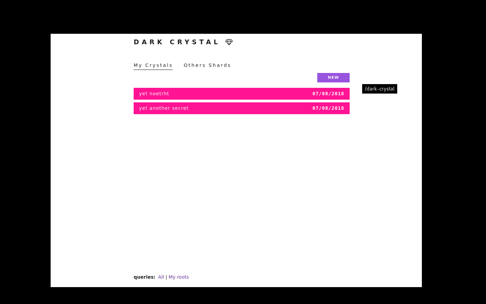

# UI Recommendations

The process of making social backups involves new concepts which can be difficult to understand.  So its important to have a carefully considered user interface, and choose good terminology to describe what is happening. 

It is also a good idea to let the peer know what is going to happen next, as this can inform the current decision.  For example, when choosing the number of shards, its good to know that they must then choose contacts which the shard will be sent to, as there is no point in choosing a high number of shards if they do not have many contacts to send them to.

In some cases it is better to first select the contacts, and then choose the threshold, with a recommended default value.

## Email client example

As an example, we will imagine making a social backup mechanism for an encrypted email client.

The objective is to secure the cryptographic key or keys used to sign and encrypt email messages.  The transport mechanism is email.

The key backup mechanism would be integrated into the email client, and mean that an option to backup keys would be present in the user interface. Keys would never need to be copied and pasted, since the email client knows where to find them.

Following key loss because of a lost device or corrupted disk, the secret-owner would reinstall the email client, associate a new keypair with their email address, and request the custodians to 'forward' their shards using their new public key.

## Letting the peer choose the threshold and number of shards

Choosing good values for the number of custodians can be confusing, so its important that the interface encourages good values to be chosen, whilst allowing for some flexibility depending on the individual situation.  We recommend giving feedback similar to how when choosing a password you might receive feedback on how strong it is. 

Another option is to have sensible default values, for example 3 of 5, and only allow changing it as an 'advanced option'.  Some implementations of secret sharing use fixed parameters, and depending on the use case this can be a good idea, giving one less thing for the peer to consider.

Here is an example interface using sliders to set the values, and a feedback indicator:

With sensible values the indicator stays green.

With progressively less sensible values the indicator changes colour, indicating either a danger of loss (threshold too high) or insecurity (threshold too low, or number of shares too high).

## Letting the peer choose trusted contacts

In the protocol specification, we have used the term 'custodians' to describe the people who will hold the shards. For a user interface, we think this term is confusing, and would recommend either 'trusted contacts' or 'friends', depending on the context.

The way of choosing contacts will depend on the transport mechanism of your application.  With our example of an encrypted email client, the transport mechanism would be email, and the possible contacts would be those who also use encryption.  Many people will have the problem that the people they trust most are not available as contacts because of this.  Which is a big challenge for this design.

It is very important that peers do not choose the wrong contacts by mistake, so the interface should display as much information about the chosen contacts as possible before getting the peer to confirm the choice. So with the example of an email client, the interface might display a portion of the most recent message to or from that peer, to make it easier to recognise if the wrong contact has accidentally been chosen.

## Delivery confirmation

This is particularly an issue for offline-first protocols.  'Sending' a message with such protocols typically means storing the message locally until the network synchronises with other peers. The user interface should make this clear, and ideally have a way of the receiving peer confirming that a message has been received.

## Gaining consent from custodians

This is a difficult problem, particularly from a user-interface perspective.

We found that sometimes people are uncomfortable about the idea taking the responsibility of looking after a shard for someone, so it is important to be able to ask if it is okay first.  Generally, we have found that people are much happier to be a custodian once they understand that they are not solely responsible - if they loose their shard, all is not lost as there are others who can help.

The problem we have found with asking for consent before sending shards is that from a usability perspective it makes the process much less quick and easy. Waiting for responses from peers takes time, and it makes the process of backing up keys more cumbersome.

Making the decision of whether to implement a consent mechanism at the user-interface level comes down to how much importance the key has. Each project is different and in some cases it makes sense and with others it doesn't.

## Push or pull notifications

This refers to whether the peer must actively seek out the information that a message has arrived (pull), or that they get some kind of visual or audio signal, such as a pop-up notification. Ideally, account recovery should not be something you need to do very often, so peers are unlikely to be regularly checking the 'account backup notifications' part of the user interface.

For this reason, we would generally recommend push notifications for important messages, such as requests for shards to be sent.  They can be intrusive, so care should be taken only to use them where is is likely that attention is needed urgently.

In some cases we have a neater solution to this problem, which is to integrate the notifications into a part of the interface which users are anyway likely to be regularly checking. With our example of an email client, these request messages are sent as email messages, so it is likely they will be received anyway.

## Contacting the trusted contacts following device loss

It is important that peers are contacted 'out of band' to confirm a new identity.  By out of band, we mean using some communications system other than that which the lost key was securing.  So it is important that the secret owner knows the custodians well enough that they have some other way of contacting them. With our example of an email client, something other than email.  Generally what works best is a voice call (or even better meeting in person), as people generally can recognise their friends voices very easily.

The user interface challenge, is to encourage this behaviour and make it difficult to accidentally forward the shard to the wrong identity.  We recommend using mnemonics to make it easy to confirm a portion of the key verbally, and that all available information associated with the new identity is displayed.

For example with our example of an email client, we might display the date and time a new public key was uploaded to a key server. 

## Interface in original dark-crystal implementation

Unlike application-specific key backup mechanisms, the original dark-crystal implementation was designed to be a generic tool for backing up any key or secret, so the peer is able to enter the secret itself.

With integrated applications this is not necessary, which is lucky because the process of copying and pasting keys can be quite cumbersome, error-prone and has security issues. 

> Click on the animation to see it enlarged

Here we see a short demo of entering data and selecting custodians in the original implementation.

This screenshot shows the history of a secret; who the shards were sent to and buttons to request them back.

## Learnings from original implementation

- [Peer testing and usability assessment](https://gitlab.com/dark-crystal/research/blob/master/dark_crystal-report_peer_testing_and_usability_assessment.md)
- [UX Report from UnderExposed Design Residency with Ura Design - Part1](https://gitlab.com/dark-crystal/research/blob/master/underexposed1.md)
- [UX Report from UnderExposed Design Residency with Ura Design - Part 2](https://gitlab.com/dark-crystal/research/blob/master/underexposed2.md)
